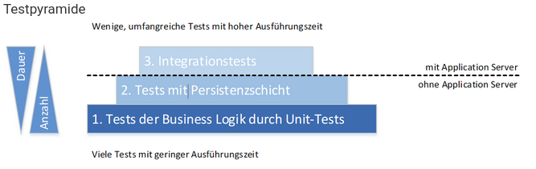
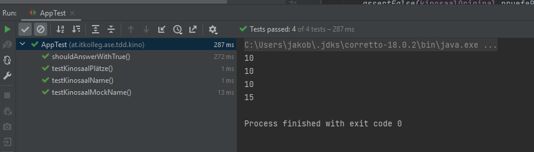
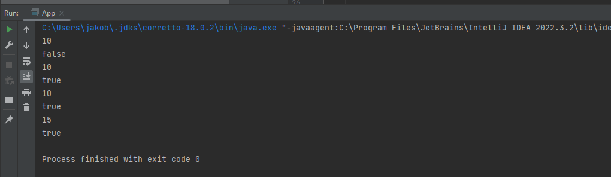

# Testdriven Development

## Theorie

### Testdriven Development

Softwaretests sind ein zenraler Bestandteil der Qualitätsdsicherung in der Softwarteentwicklung.
Heute liegt der schwerpunkt auf automatisiertes Testen.

Bei Testdriven Development (TDD) wird vorher der Test geschrieben, bevor das eigentliche Projekt erstellt wird. 

### Red-Green-Refactor

Beim Red-Green-Refactor wird folgensdermaßen beschrieben.
Durch die primäre Testerstellung ist der Test Rot. Beim Hinzufügen des Codes schaltt der Test auf Grün (vorausgesetzt der Code beinhaltet keine Fehler). 
Hier wird sicher gestellt, dass von Anfang an der Code funktioniert.  

### FIRST-Acronym

- **Fast**: Ein Test sollte nict zu lange dauern. Wenn in Methoden oder Klassen nur kleine Änderungen vorgenommen werden, sollte de Test nicht zu lange dauern, um diese Änderugen zu testen.
- **Intependent**: Tests dürfen nicht von anderen Tests abhängig sein. Dies soll sicherstellen, dass jeder Test individuell ausgeführt werden können.
- **Repeatable**: Jeder Test muss wiederholt werden können, ohne dass sich der Output ändert.
- **Self-validating**: Jeder Test hat einen Output des Eregebnisses, boolean true oder false. Man solölte nicht selber nachschauen müssen, ob die Testmethode richtig funktioniert. Dies passiert normalerweise mit den Funktionen *assertTrue* oder *assertEquals*, je nachdem welches Ergebnis erwartet wird.
- **Timely**: Unit Tests sollten vor dem Projektcode implementiert werden.

### Kent Beck

Kent Beck ist ein amerikanischer Software-Entwickler. Er it einer der Hauptfiguren bei der Entwicklung und Integration von Testdriven Development. er entwickelte zusammen mit Erich Gamma das JUnit Framework.

### Testarten

Drei Arten:
- Unit Tests
- Integration Tests
- Acceptance Tests

**Unit Tests**

Testungen von einzelnen Komponenten, Methodentests.

**Integration Tests**

Testet die Interaktion zwischen den verschiedenen Komponenten. Zum Beispiel die Testung er Kommunikation zwischen Server und Application.

**Acceptance Tests**

Diese Tests überprüfen, ob das System als Ganzes wie erwartet funktioniert. Sie überprüfen normalerweise die Benutzeroberfläche oder die API des Systems und stellen sicher, dass es die Anforderungen erfüllt und die Bedürfnisse der Benutzer erfüllt.

### Testpyramide

Die Testpyramide beschreibt den Ablauf und Priorisierung dre obenen beschriebenen Testverfahren.
Es empfielt sich eine hohe Testdichte mit verschiedenen Tests durchzuführen, Einsatz verschiedener, kombinierter Teststufen sollten herangezogen werden.



### JUNIT 

JUnit ist ein Diese Tests werden huaptsächlich zur Testung von kleinen Units, Methoden, hergenommen. 
Das Framework kann mittels Maven in das Projekt integriert werden.

### Mockito

Mockito wird für Integrationstests verwendet. Bei diesen Tests werden die einzelnen Klassen nicht autark getestet, sondern beziehen noch andere KLassen mit ein. Doch um die Unabhängigkeit des Tests zu gewährleisten, kann Mockito verwendet werden. Durch dieses Framework können Mocks, das sind Dummydaten, bereit gestellt werden und in den Test integriert werden. Durch diese Mocks werden in einem Test Daten bereit gestellt, die im normalen Programm von einer anderen Klasse/Methode aufgerufen werden.

## AUFGABE 2: AUSGANGSPROJEKT

Laden Sie sich das gegebene Maven-Ausgangsprojekt („TDD Kino Demo“, siehe Moodle) herunter. Laden Sie es
als Maven-Projekt in ihre IDE und schauen Sie sich an, wie das Projekt aufgebaut ist.

### pom.xml (Dependencies, Java-Version etc.)

- **Java-Version** 
```xml
<properties>
    <project.build.sourceEncoding>UTF-8</project.build.sourceEncoding>
    <maven.compiler.source>17</maven.compiler.source>
    <maven.compiler.target>17</maven.compiler.target>
  </properties>

```
- **Dependencies**

```xml
<dependencies>

    <!-- https://mvnrepository.com/artifact/org.junit.jupiter/junit-jupiter -->
    <!-- use of this aggregator artifact makes stating individual artifacts obsolete -->
    <dependency>
      <groupId>org.junit.jupiter</groupId>
      <artifactId>junit-jupiter</artifactId>
      <version>5.8.2</version>
      <scope>test</scope>
    </dependency>
```

```xml

    <!-- https://mvnrepository.com/artifact/org.mockito/mockito-junit-jupiter -->
    <dependency>
      <groupId>org.mockito</groupId>
      <artifactId>mockito-junit-jupiter</artifactId>
      <version>4.3.1</version>
      <scope>test</scope>
    </dependency>

  </dependencies>

```

### **gegebene Domänenklassen**

 **KinoSaal**

 Besitzt Datenfelder für den Namen als String und fürdie Reihen des Saals als Map, indem Key/ Value gespeichert wird.
 Beim Konstruktor muss der Name und die Map (Character als Key, Integer als Value) mitgegeben werden.
 Methoden der Klasse sind:
 - getName: Rückgabe des Namen
 - pruefePlatz: Hier wird geprüft, ob der Platz noch zur Verfügung steht.
 - equals: Generiert ein Clon für ein gegebenes Objekt, in diesem Fall Kinosaal. Dann wird geprüft, ob das Objekt eine Instanz von KinoSaal ist. Wenn die Prüfung fehlschlägt, wird false zurück gegeben, bei korrekter Prüfung wird **this.name.equals(((KinoSaal) obj).getName());** zurückgegeben.

 **KinoVerwaltung**

 Datenfeld ist eine Liste von Vorstellungen.
 - einplanenVorstellung: Hier wird geprüft, ob eine bestimmte Vorstellung in der Liste enthalten ist. Falls dies nicht der Fall ist, wird die Vorstellung der Liste hinzugefügt.
 - getVorstellungen: Vorstellung wird zurück gegeben.
 - kaufeTicket: Für diese Methode muss die Vorstellung, die Reihe, den Platz und das Geld angegeben werden.

 **Ticket**

 Datenfelder für die Klasse sind:
 - saal: String
 - Zeitfenster: Zeitfenster
 - datum: LocalDate
 - reihe: Char
 - platz: int

 Der Konstruktor braucht die Werte saal, zeitfenster, datum, reihe und platz zum Erstellen eines neuen Objekts.

 Methoden der Klasse:

 - getSaal(): gibt den Saal zurück
 - getZeitfenster(): gibt das Zeitfenster zurück
 - getDatum(): gibt das Datum zurück
 - getReihe(): gibt die Reihe des Objekts zurück
 - getPlatz(): gibt den Platz zurück

 **Vorstellung**

 Datenfelder der Klasse:
- saal: KinoSaal
- zeitfenster: ZeitFenster
- datum: LocalDate
- film: String
- preis: float

- tickets: LinkedList

Der Konstruktor braucht die Werte saal, zeitfenster, datum, film und preis zum Erstellen eines neuen Objekts.

Methoden der Klasse:

- getFilm(): gibt den Film der Vorstellung zurück
- getSaal(): gibt den Saal zurück
- getZeitfenster(): gibt das Zeitfenster zurück
- getDatum(): gibt das Datum zurück
- kaufeTicket(): es muss rihe, platz und das Geld angegeben  werden. In dieser Methode wird überprüft, ob das Geld ausreicht, der Platz belegt ist und ob der Platz überhaupt existiert.

- equals: Generiert ein Clon für ein gegebenes Objekt, in diesem Fall Vorstellung. Dann wird geprüft, ob das Objekt eine Instanz von Vorstellung ist.

 **Zeitfenster**

 Die KLasse Zeitfenster ist eine Enum-Klasse.

### **Gegebene Start-Unit5-Tests**

- Unittest für Kinosaal.
- Unittest für Sitzplätze des Kinosaals
- Unittest für den Namen des Kinosaals

*AppTest*



*App*



## AUFGABE 3: EINARBEITUNG IN DEN GEGEBENEN CODE

Arbeiten Sie sich in den gegebenen Code zur Kinoverwaltung ein. Verwenden Sie die gegebenen Klassen
KinoSaal, Ticket, Vorstellung, Kinoverwaltung in der App-Klasse (main-Methode), um ein Gefühl für die
Funktionsweise des Programms zu bekommen. Führen Sie folgende Punkte durch:

- Kinosäle anlegen
- Vorstellungen anlegen
- Vorstellungen über die Kinoverwaltung einplanen
- Tickets für Vorstellungen ausgeben
- etc.

```java

public class App 
{
    public static void main( String[] args )
    {
        //Saal anlegen

        Map<Character,Integer> mapks1 = new HashMap<>();
        mapks1.put('A',15);
        mapks1.put('B',15);
        mapks1.put('C',15);
        mapks1.put('D',15);
        mapks1.put('E',15);
        mapks1.put('F',15);

        Map<Character,Integer> mapks2 = new HashMap<>();
        mapks1.put('A',10);
        mapks1.put('B',10);
        mapks1.put('C',15);
        mapks1.put('D',15);
        mapks1.put('E',15);

        Map<Character,Integer> mapks3 = new HashMap<>();
        mapks1.put('A',10);
        mapks1.put('B',10);
        mapks1.put('C',10);
        mapks1.put('D',10);
        mapks1.put('E',10);


        KinoSaal ks1 = new KinoSaal("Big Theatre",mapks1);
        KinoSaal ks2 = new KinoSaal("Theatre Mittleton", mapks2);
        KinoSaal ks3 = new KinoSaal("TinyT", mapks3);

        // Vorstellungen anlegen

        Vorstellung vs1 = new Vorstellung(ks1,Zeitfenster.ABEND, LocalDate.parse("2023-04-16"),"Super Mario Film", 15);
        Vorstellung vs2 = new Vorstellung(ks2, Zeitfenster.NACHT,LocalDate.parse("2023-04-23"),"Dungeons & Dragons", 10);
        Vorstellung vs3 = new Vorstellung(ks3,Zeitfenster.NACHMITTAG,LocalDate.parse("2023-05-02"), "Die drei ???",11);

        // Vorstellungen über Kinoverwaltung einplanen

        KinoVerwaltung kv1 = new KinoVerwaltung();
        kv1.einplanenVorstellung(vs1);
        kv1.einplanenVorstellung(vs2);
        kv1.einplanenVorstellung(vs3);

        // Tickets für Vorstellungen ausgeben

        kv1.kaufeTicket(vs1,'E',5,20);
        kv1.kaufeTicket(vs1,'C',10,15);

        //...

    }
}


```

## AUFGABE 4: JUNIT-TESTS FÜR KINOSAAL

Testen Sie alle Methoden der Klasse KinoSaal (Testklasse TestKinoSaal).

```java

package at.itkolleg.ase.tdd.kino;

import at.itkolleg.ase.tdd.kino.KinoSaal;
import org.junit.jupiter.api.BeforeEach;
import org.junit.jupiter.api.Test;
import java.util.HashMap;
import java.util.Map;
import static org.junit.jupiter.api.Assertions.*;

public class TestKinoSaal {

    KinoSaal originalSaal;
    Map<Character, Integer> reihen = new HashMap<>();
    @BeforeEach
        void setup()
        {
            reihen.put('A', 10);
            reihen.put('B', 11);
            reihen.put('C', 15);


            originalSaal = new KinoSaal("Saal 1", reihen);
        }


    @Test
    public void testKinosaalName() {
        String expectedName = "Saal 1";
        String actualName = originalSaal.getName();
        assertEquals(expectedName, actualName);
    }

    @Test
    public void testKinosaalPlätze() {


        KinoSaal saal = new KinoSaal("Saal 1", reihen);
        assertTrue(saal.pruefePlatz('A', 3));
        assertFalse(saal.pruefePlatz('B', 18));
        assertFalse(saal.pruefePlatz('E', 20));
        assertFalse(saal.pruefePlatz('A', 0));
    }

    @Test
    public void testKinosaalEquals() {
        Map<Character, Integer> reihen = new HashMap<>();
        KinoSaal saal1 = new KinoSaal("Saal 1", reihen);
        KinoSaal saal2 = new KinoSaal("Saal 2", reihen);
        KinoSaal saal3 = new KinoSaal("Saal 1", reihen);
        assertEquals(saal1, saal3);
        assertNotEquals(saal1, saal2);
    }
}


```

## AUFGABE 5: JUNIT-TESTS FÜR VORSTELLUNG

Testen Sie alle Methoden der Klasse Vorstellung (Testklasse TestVorstellung).

```java

package at.itkolleg.ase.tdd.kino;

import org.junit.jupiter.api.BeforeEach;
import org.junit.jupiter.api.Test;

import java.time.LocalDate;
import java.util.HashMap;
import java.util.Map;

import static org.junit.jupiter.api.Assertions.*;

public class TestVorstellung {

    private Vorstellung testvorstellung;
    private KinoSaal saal;

    @BeforeEach
    void setup() {
        //Saal anlegen
        Map<Character, Integer> map = new HashMap<>();
        map.put('A', 10);
        map.put('B', 10);
        map.put('C', 15);
        saal = new KinoSaal("ks1", map);
        testvorstellung = new Vorstellung(this.saal,Zeitfenster.ABEND, LocalDate.of(2023, 4, 23),"Super Mario Bros",10.50f);
    }

    @Test
    void testGetFilm()
    {
        assertEquals("Super Mario Bros", testvorstellung.getFilm());
    }

    @Test
    void testGetSaal()
    {
        assertEquals("ks1", testvorstellung.getSaal().getName());
    }

    @Test
    void testGetZeitfenster()
    {
        assertEquals(Zeitfenster.ABEND, testvorstellung.getZeitfenster());
    }

    @Test
    void testGetDatum()
    {
        assertEquals(LocalDate.of(2023, 04, 23), testvorstellung.getDatum());
    }

    @Test
    void testKaufeTicket()
    {
        Ticket ticket = testvorstellung.kaufeTicket('A', 5, 12);
        assertNotNull(ticket);
        assertEquals(saal.getName(), ticket.getSaal());
        assertEquals(Zeitfenster.ABEND, ticket.getZeitfenster());
        assertEquals(LocalDate.of(2023, 4, 23), ticket.getDatum());
        assertEquals('A', ticket.getReihe());
        assertEquals(5, ticket.getPlatz());
    }

    @Test
    void testEquals()
    {
        assertFalse(testvorstellung.equals(testvorstellung.getSaal()));
    }

}


```

## AUFGABE 6: JUNIT-TESTS FÜR KINOVERWALTUNG

Testen Sie alle Methoden der Klasse KinoVerwaltung (Testklasse TestKinoverwaltung).

```java

package at.itkolleg.ase.tdd.kino;

import static org.junit.Assert.*;
import static org.junit.jupiter.api.Assertions.assertThrows;

import java.time.LocalDate;
import java.util.HashMap;
import java.util.List;
import java.util.Map;

import org.junit.Before;
import org.junit.Test;
import org.junit.jupiter.api.BeforeEach;


public class TestKinoverwaltung {

    KinoVerwaltung kino = new KinoVerwaltung();
    Map<Character, Integer> map = new HashMap<>();
    KinoSaal saal;
    Vorstellung vorstellung;
    @BeforeEach
    void setup() {
        //Saal anlegen

        map.put('A', 10);
        map.put('B', 10);
        map.put('C', 15);

        saal = new KinoSaal("Saal 1",map);
        vorstellung =new Vorstellung(saal,Zeitfenster.ABEND, LocalDate.of(2023, 4, 23),"Super Mario Bros",10.50f);

    }
    @Test
    public void testEinplanenVorstellung() {

        kino.einplanenVorstellung(vorstellung);
        assertEquals(1, kino.getVorstellungen().size());
        assertThrows(IllegalArgumentException.class, () -> kino.einplanenVorstellung(vorstellung));
    }

    @Test
    public void testKaufeTicket() {
        KinoVerwaltung kino = new KinoVerwaltung();
        kino.einplanenVorstellung(vorstellung);
        Ticket ticket = kino.kaufeTicket(vorstellung, 'A', 5, 10.0f);
        assertNotNull(ticket);
        assertEquals('A', ticket.getReihe());
        assertEquals(5, ticket.getPlatz());

    }

}


```
## AUFGABE 7: JUNIT-TESTS ADVANCED

Falls nicht schon in den vorhergehenden Aufgaben passiert, testen Sie folgende Punkte unter Verwendung der
fortgeschrittenen Features von JUNIT 5:

- Schreiben Sie einen Test, der validiert, dass das Anlegen einer Vorstellung korrekt funktioniert. Der
Test sollte eine fachliche Bezeichnung haben und die Assertions sollten bei Validierungsfehler eine
Hinweistext liefern.

```java
  @Test
    void testVorstellungErstellen()
    {
        assertDoesNotThrow(()-> {
            assertEquals("ks1", testvorstellung.getSaal().getName());
            assertEquals(Zeitfenster.ABEND, testvorstellung.getZeitfenster());
            assertEquals(LocalDate.of(2023, 4, 23), testvorstellung.getDatum());
            assertEquals("Super Mario Bros", testvorstellung.getFilm());
            assertEquals(10.50f, testvorstellung.getPreis());
        }, "FEHLER: Vorstellung kann nicht angelegt werden!");
    }

```

- Schreiben Sie einen Test, der validiert, dass das Einplanen mehrerer Vorstellungen korrekt
funktioniert. Stellen Sie zudem sicher, dass beim möglichen Auftreten eines Fehlers trotzdem alle
Validierungen ausgeführt werden.

```java
 @Test
    public void testEinplanenVorstellung() {

        kino1.einplanenVorstellung(vorstellung1);
        kino2.einplanenVorstellung(vorstellung2);

        assertEquals(1, kino1.getVorstellungen().size());
        assertEquals(1, kino2.getVorstellungen().size());

        assertThrows(IllegalArgumentException.class, () -> kino1.einplanenVorstellung(vorstellung1));
        assertThrows(IllegalArgumentException.class, () -> kino2.einplanenVorstellung(vorstellung2));

    }

```
- Schreiben Sie einen Test, der sicherstellt, dass ein Fehler geworfen wird, wenn eine Veranstaltung
doppelt eingeplant wird.

```java
  @Test(expected = IllegalArgumentException.class)
    public void testDoppelteVorstellung()
    {
        kino1.einplanenVorstellung(vorstellung1);
        kino1.einplanenVorstellung(vorstellung1);
    }
```
- Schreiben Sie einen parametrisierten Test, der mehrere Ticketkäufe mit unterschiedlichen Parametern
überprüft.

```java
 @Test
    public void testKaufeTicket() {
        Map<Character, Integer> map = new HashMap<>();
        map.put('A', 10);
        map.put('B', 10);
        map.put('C', 15);

        KinoSaal kinosaal = new KinoSaal("Saal 1",map);
        KinoVerwaltung kino = new KinoVerwaltung();
        Vorstellung vorstellung =new Vorstellung(kinosaal,Zeitfenster.ABEND, LocalDate.of(2023, 4, 23),"Super Mario Bros",10.50f);
        kino.einplanenVorstellung(vorstellung);
        Ticket ticket1 = kino.kaufeTicket(vorstellung, 'A', 5, 10.50f);
        Ticket ticket2 = kino.kaufeTicket(vorstellung, 'A', 6, 10.50f);
        Ticket ticket3 = kino.kaufeTicket(vorstellung, 'B', 5, 10.50f);

        assertNotNull(ticket1);
        assertNotNull(ticket2);
        assertNotNull(ticket3);
        assertEquals('A', ticket1.getReihe());
        assertEquals(5, ticket1.getPlatz());
        assertEquals('A', ticket2.getReihe());
        assertEquals(6, ticket2.getPlatz());
        assertEquals('B', ticket3.getReihe());
        assertEquals(5, ticket3.getPlatz());

    }
```
- Schreiben Sie eine dynamische TestFactory die den Ticketkauf mit zufälligen Werten bombardiert. Der
Test soll sicherstellen, dass der Ticketkauf entweder funktioniert oder nur einen der definierten
Fehlermeldungen (z.B. new IllegalArgumentException("Nicht ausreichend Geld.")) ausgibt. Die Tests
müssen reproduzierbar sein.

## AUFGABE 8: MOCKITO EINFÜHRUNG

Lesen Sie sich in das Mocking-Framework Mockito ein (Links siehe Moodle im Abschitt „Input zu Mockito“).
Verwenden Sie die wesentlichen Mockito-Möglichkeiten praktisch in kleinen Programmen.

```java
package at.itkolleg;

import org.junit.jupiter.api.BeforeEach;
import org.junit.jupiter.api.Test;

import static org.junit.Assert.assertEquals;
import static org.mockito.Mockito.mock;
import static org.mockito.Mockito.when;

public class TestManualMock {

    private Console c1;
    private Game g1;

    @BeforeEach
    void setup()
    {
        c1 = mock(PlayStation5.class);
        g1 = new Game("The Witcher 3: Wild Hunt","CD Project Red",c1,false);
    }

    @Test
    void testMock()
    {
        when(c1.getModell()).thenReturn("5");
        assertEquals("5",g1.getConsole().getModell());
    }
}

```

```java
package at.itkolleg;

import org.junit.jupiter.api.AfterEach;
import org.junit.jupiter.api.BeforeEach;
import org.junit.jupiter.api.Test;
import org.mockito.Mock;
import org.mockito.MockitoAnnotations;

import static org.junit.Assert.assertEquals;
import static org.mockito.Mockito.mock;
import static org.mockito.Mockito.when;

public class TestMockAnnotation {
    @Mock
    private Console c1;
    private Game g1;
    private AutoCloseable closeable;

    @BeforeEach
    void setup()
    {
        closeable = MockitoAnnotations.openMocks(this);
        g1 = new Game("The Witcher 3: Wild Hunt","CD Project Red",c1,false);
    }

    @AfterEach
    void close() throws Exception
    {
        closeable.close();
    }

    @Test
    void testMock()
    {
        when(c1.getModell()).thenReturn("5");
        assertEquals("5",g1.getConsole().getModell());
    }
}

```

```java
package at.itkolleg;

import org.junit.jupiter.api.AfterEach;
import org.junit.jupiter.api.BeforeEach;
import org.junit.jupiter.api.Test;
import org.mockito.InjectMocks;
import org.mockito.Mock;
import org.mockito.MockitoAnnotations;

import static org.junit.Assert.assertEquals;
import static org.mockito.Mockito.mock;
import static org.mockito.Mockito.when;

public class TestInjectMocks {
    @Mock
    private Console c1;
    private AutoCloseable closeable;
    @InjectMocks
    private Game g1 =new Game("The Witcher 3: Wild Hunt","CD Project Red",c1,false);


    @BeforeEach
    void setup()
    {
        closeable = MockitoAnnotations.openMocks(this);

    }

    @AfterEach
    void close() throws Exception
    {
        closeable.close();
    }

    @Test
    void testMock()
    {
        when(c1.getModell()).thenReturn("5");
        assertEquals("5",g1.getConsole().getModell());
    }
}

```

```java
package at.itkolleg;

import org.junit.jupiter.api.AfterEach;
import org.junit.jupiter.api.BeforeEach;
import org.junit.jupiter.api.Test;
import org.junit.jupiter.api.extension.ExtendWith;
import org.mockito.InjectMocks;
import org.mockito.Mock;
import org.mockito.MockitoAnnotations;
import org.mockito.junit.jupiter.MockitoExtension;

import static org.junit.Assert.assertEquals;
import static org.mockito.Mockito.mock;
import static org.mockito.Mockito.when;

@ExtendWith(MockitoExtension.class)
public class TestJunit5Mock {
    @Mock
    private Console c1;
    @InjectMocks
    private Game g1 =new Game("The Witcher 3: Wild Hunt","CD Project Red",c1,false);


    @Test
    void testMock()
    {
        when(c1.getModell()).thenReturn("5");
        assertEquals("5",g1.getConsole().getModell());
    }
}

```

## AUFGABE 9: SELENIUM EINFÜHRUNG

Lesen Sie sich in das Browser-Testframework Selenium ein (Links siehe Moodle im Abschnitt „Input zu
Selenium“).
Verwenden Sie das gegebene Beispiel und das Tutorial „Guide to Selenium with JUnit / TestNG“ um die
Möglichkeiten von Selenium praktisch auszuprobieren.

## Aufgabe 10: TDD IS DEAD

Der Diskurs über Sinn und Unsinn von TDD in der Praxis ist durchaus kontroversiell. TDD hat offensichtlich nicht
nur Vorteile.
Versuch über folgenden Link herauszufinden, welche Argumente Kritiker und Befürworter zum Thema TDD
bzw. automatisiertem Testen von Code ins Treffen führen und übertrage deine Erkenntnisse in die eigene
Praxis.

*Vorteile:*
- Isolation von den verschiedenen Methoden mittles Mockdaten
- Verbessern des Codedesigns, niedere Kopplung - hohe Kohäsion erforderlich
- Besseres Verständnis des Codes
- Testabdeckung von 100%
- Red-Green-Faktor:Test schreiben, Methode schreiben, aufräumen.

*Nachteile:*
- Wenn man den Aufbau einer Methode nicht weiß, ist ein vorhergehender Test nicht zweckmäßig
- Bei einer Änderung einer Funktion können mehrere Tests wieder angepasst werden.
- Durch die Mocks  kann es passieren, dass der Fokus auf die Testung der Schnittstellen vergessen wird.
- Es muss sehr diszipliniert gearbeitet werden, ansonsten falscher Ansatz
- Faith in the Test -> die Hoffnung, dass der Test funktioniert, jedoch sich nicht auf den Code konzentriert.

Meiner Meinung nach ist das TDD ein sinnvolles Tool, um die Sauberkeit des eigenen Codes verbessern zu können, um seinen Code besser zu verstehen (wieso funktioniert der Test nicht, bzw. wieso funktioniert der Test) und ein besseres Gefühl gibt, da man den Code selber analysiert und hinterfragt.
Jedoch braucht man sehr viel Disziplin, die man sich am Anfang schon sehr einprägen sollte. Eine zeitliche Disziplin, da die Erstellung der Test einige Zeit in Anspruch nimmt. Auch eine Disziplin des Lernens, um einen sinnvollen Test erstellen zu können.Auch die Disziplin einen erstellten Code zu verwerfen, wenn dieser nicht funktoniert.